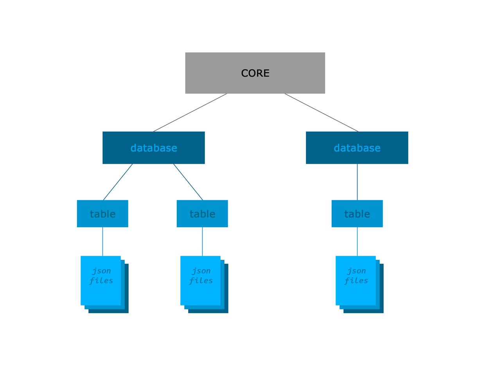

This is the NoSQL database implemented on the file structure. This version of database only can use with NodeJS.
<br><br>



<br>

### Methods and how to use them:
<br>

```
db.remove() - remove all databases
db.select('database').remove() - remove database
db.select('database').table('table').remove() - remove table
db.select('database').table('table').remove('id') - remove row by id
db.select('database').table('table').clean() - clean table
```
```
db.select('database') - create or select database
db.select('database').table('table') - create or select table
db.select('database').table('table').insert({}) - insert data to row
```
```
db.select('database').table('table').get() - return all data from the table
db.select('database').table('table').find({ any: '>=2000, <=3000' }).get()
- show the rows where the number more or equal 2000 and less or equal 3000
db.select('database').table('table').get(20, 10) - get next 10 rows from 20 to 30
db.select('database').table('table').sortby(value, 'desc').get() - sort data by value
db.all() - get all row paths in all databases
```

<br>

### Examples:
<br>

1. Insert data to database
```
db.select('database').table('table').insert({ id: '1', name: 'test', price: '100', url: 'https' });
```
id must be a unique number.\
if you add data without id, id will be automatically added to the inserted data and begin from 1 and so on
<br><br>

2. Find data
```
db.select('database').table('table').find({ id: '1'}).get() ->
{
  data: [
    { id: '1325455', name: 'test', price: 100 }
  ],
  count: 0,
  max_items: 1
}
```
```
db.select('database').table('table').find({ name: 'test', price: '<500' }).get() ->
{
  data: [
    { id: '5465436', name: 'test', price: 120 },
    { id: '1325455', name: 'test', price: 100 }
  ],
  count: 0,
  max_items: 2
}
```
3. Remove table
```
/database/table/rows
/database/table_2/rows
/database/table_3/rows

db.select('database').table('table').remove() ->

after:
/database/table_2/rows
/database/table_3/rows
```
4. Get data by 10 rows
```
db.select('database').table('table').find({ name: 'test', price: '<500' }).get(0, 10);
```
you will get first ten or less rows which respond filter
<br><br>

```
db.select('database').table('table').find({ name: 'test', price: '<500' }).get(10, 10);
```
you will get next ten rows and so on
<br><br>

5. Sort data
```
db.select('database').table('table').sortby('price').get() ->
{
  data: [
    { id: '1325455', name: 'test', price: 100 },
    { id: '5465436', name: 'test', price: 120 },
    { id: '6754757', name: 'test', price: 500 }
  ],
  count: 0,
  max_items: 3
}
```
```
db.select('database').table('table').sortby('name').get() ->
{
  data: [
    { id: '6754757', name: 'chatgpt', price: 500 },
    { id: '1325455', name: 'others', price: 100 },
    { id: '5465436', name: 'you', price: 120 }
  ],
  count: 0,
  max_items: 3
}
```
you can set the second value in sortby method: 'desc', default - 'asc'
<br><br>

6. Combine
```
db.select('database').table('table').sortby('price', 'desc').find({ name: 'test' }).get(0, 1);
```

7. Get all data
```
db.all() ->
[
  {
    database: 'database',
    table: 'table',
    row: '5465436',
    data: { id: '5465436', name: 'test', price: 120 }
  },
  {
    database: 'database',
    table: 'table',
    row: '6754757',
    data: { id: '6754757', name: 'test', price: 500 }
  },
  {
    database: 'database',
    table: 'table',
    row: '1325455',
    data: { id: '1325455', name: 'test', price: 100 }
  }
]
```

<br>

### Important!
Before using any kind of methods: find, sortby or insert, you must select "database" and "table"
